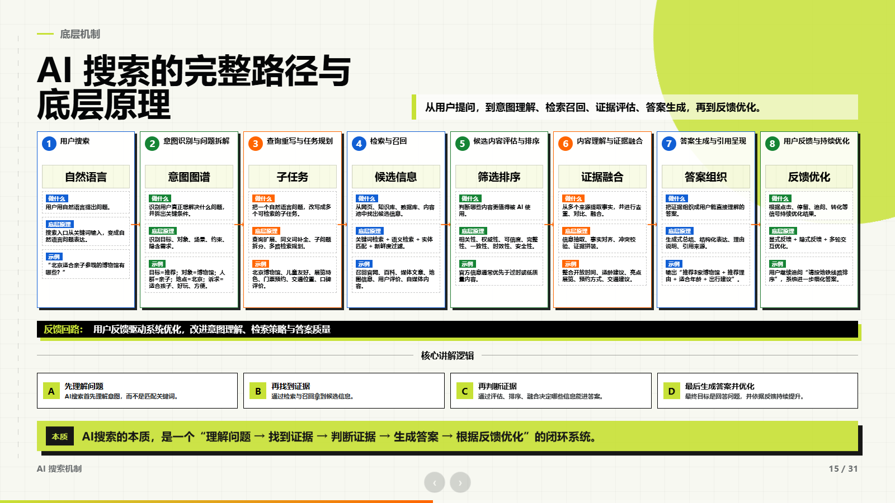

# TaoHtml

TaoHtml 是一个面向 Codex / AI Agent 的高设计 HTML 课件与报告生成 skill。

它不是简单把内容“排成几页”，而是帮助 Agent 把 PDF、截图、汇报材料、课程大纲、路演内容、已有 HTML 课件，重构成一套可演讲、可追溯、可互动、可打包迁移的 HTML Presentation。

> English brief: TaoHtml is a Codex skill for turning PDFs, screenshots, outlines, reports, and existing decks into high-design, source-traceable HTML presentations.

## 真实案例：GEO 沙龙路演 HTML

TaoHtml 的第一个标杆案例，是一套用于线下沙龙的 GEO 路演课件。这个案例不是静态美化，而是从真实演讲场景出发，把海报风格、AI 问答模拟、真实采样截图、视频录屏、复采报告、服务转化页整合成一套可用翻页器推进的 HTML 课件。



这个案例展示了 TaoHtml 最核心的能力：

- 把普通内容大纲重构成完整演讲主线。
- 把截图、报告、视频这类真实证据变成可读的演示页面。
- 用统一视觉系统承接全篇：黑白高反差、荧光黄绿色、橙色风险提示、网格、标尺、圆弧和证据窗口。
- 把页面交互改成翻页器友好的串行展开，而不是依赖鼠标悬停。
- 在商业课件末尾加入服务入口、报价页和可执行下一步。

查看更多截图和拆解：

- [Demo Gallery](docs/gallery.md)
- [案例拆解：GEO 沙龙路演 HTML](docs/cases/geo-salon.md)

如果 TaoHtml 对你有帮助，欢迎给这个项目点一个 Star，方便后续更新。

## TaoHtml 解决什么问题

很多 AI 生成的课件会出现两个极端：

1. 只是把原 PDF 包成一个浏览器页面，看起来像 PDF 阅读器。
2. 页面变好看了，但原始信息、图表、证据和业务逻辑被丢掉。

TaoHtml 的核心原则是：

> 主页面负责演讲和说服，证据层负责信息保真，QA 流程负责交付可靠。

它不是单纯“美化 PPT”，而是把报告重构成一套完整的 HTML 演示系统。

## 核心能力

- 将 PDF / 截图 / 文档 / 旧课件转成 HTML 演示稿。
- 判断应该做“忠实迁移”还是“路演重构”。
- 保留原始信息：通过原始页按钮、证据弹窗、附录页、下载文件承载完整来源。
- 重构演讲主线：从受众决策、故事脊柱、证据链开始设计页面。
- 避免普通卡片堆砌：内置高设计评分尺和版式母型库。
- 支持本地 HTML：键盘翻页、分步展开、原始页弹窗、进度条、离线使用。
- 支持交付检查：资产路径检查、浏览器截图 QA、总览图、zip 打包。

## 适合哪些场景

- 路演课件
- 客户提案
- 内部汇报
- 培训课程
- 产品演示
- 诊断报告
- 商业服务介绍
- PDF 报告重构
- 带口播稿的沙龙 / 课程课件

## 项目结构

```text
TaoHtml/
├─ README.md
├─ LICENSE
├─ docs/
│  ├─ gallery.md
│  ├─ cases/
│  │  └─ geo-salon.md
│  ├─ assets/
│  ├─ product-introduction.md
│  └─ workflow.md
├─ examples/
│  └─ prompts.md
└─ skill/
   └─ taohtml/
      ├─ SKILL.md
      ├─ agents/
      ├─ assets/
      ├─ references/
      └─ scripts/
```

真正可安装的 Codex skill 位于：

```text
skill/taohtml
```

## 安装方式

将 `skill/taohtml` 复制到你的 Codex skills 目录。

Windows PowerShell:

```powershell
Copy-Item -Recurse -Force .\skill\taohtml $env:USERPROFILE\.codex\skills\taohtml
```

macOS / Linux:

```bash
cp -R ./skill/taohtml ~/.codex/skills/taohtml
```

然后重启 Codex，或新开一个线程，让 skill 列表刷新。

## 快速使用

对 Codex 说：

```text
使用 $taohtml，把这个 PDF 改成一个高设计感的 HTML 路演课件。
不要丢失原始信息，原始页可以放在证据弹窗或附录里，但主页面要重新设计成适合现场演讲的版本。
```

或者：

```text
使用 $taohtml，帮我升级这个已有 HTML 课件。
重点优化故事结构、视觉层级、证据页、动画节奏、翻页器友好的分步展开，以及最终可迁移打包。
```

## TaoHtml 的工作流

TaoHtml 会引导 Agent 依次判断：

1. 受众决策：看完之后，受众应该相信什么、做什么？
2. 故事脊柱：用什么顺序才能自然推出结论？
3. 输出模式：忠实迁移，还是路演重构？
4. 证据层：原始事实、截图、图表、报告、视频放在哪里？
5. 视觉命题：这个主题应该被设计成什么样的视觉世界？
6. 页面版式：每页到底承担什么角色，应该用什么构图？
7. HTML 实现：本地、离线、16:9、翻页器友好、可打包。
8. QA 交付：资产检查、浏览器截图、总览图、zip 打包。

## 内置资源

### 参考文档

- `process-playbook.md`：完整课件 / 报告生产流程。
- `design-quality-rubric.md`：100 分高设计评分标准和硬性失败门槛。
- `layout-pattern-library.md`：12 类高设计版式母型。

### HTML 模板

- `assets/html-deck-template/index.html`：本地 16:9 HTML 课件壳，包含翻页、分步展开、原始页弹窗、进度条。

### 脚本

- `extract_pdf_pages.py`：将 PDF 页面渲染成 PNG 证据素材。
- `check_assets.py`：检查普通资源、`data-source`、`srcset`、远程资源和不可迁移的本地绝对路径。
- `check_html_deck.py`：用 Playwright 在 1600x900 下检查 hash 路由、分步展开、证据弹窗、媒体加载、控制台错误和可见区域边界。
- `build_contact_sheet.py`：把 QA 截图合成总览图。
- `package_deck.py`：将 HTML 课件文件夹打包成 zip。

## 开发、验证与版本管理

项目版本记录在根目录 `VERSION`，遵循 Semantic Versioning；正式发布使用 `vMAJOR.MINOR.PATCH` tag。功能和修复在独立分支完成，通过自动化质量检查并合并到 `main` 后再创建 tag 和 GitHub Release。

当前版本：`0.1.0`

本地验证：

```bash
python3 -m venv .venv
source .venv/bin/activate
python -m pip install -r requirements.txt
python -m playwright install chromium

python -m unittest discover -s tests -v
python -m py_compile skill/taohtml/scripts/*.py
python skill/taohtml/scripts/check_assets.py skill/taohtml/assets/html-deck-template/index.html
python skill/taohtml/scripts/check_html_deck.py skill/taohtml/assets/html-deck-template/index.html .artifacts/template-qa
```

每个版本的可见变化记录在 `CHANGELOG.md`。不要直接在 `main` 上开发，也不要在质量检查通过前创建版本 tag。

## 设计标准

TaoHtml 是有明确审美立场的：

- 不从页面开始，从受众决策和证据链开始。
- 不装饰坏结构，先修故事。
- 不只复制参考风格的颜色，而要复制构图、层级、证据处理和动效语法。
- 不把截图当装饰，关键证据必须可读、可追溯。
- 不依赖鼠标悬停和小点击区域，现场演讲必须能用翻页器推进。
- 不在资产路径、视频、截图没有检查的情况下交付。

## 作者与合作

TaoHtml 由 Tao 发起，用于探索 AI Agent 如何参与高质量 HTML 课件、路演报告和证据型汇报的生产。

如果你对以下方向感兴趣，可以联系我：

- 企业汇报 / 路演课件 HTML 化
- AI Agent skill 定制
- 高设计感商业报告与演示系统
- GEO / 内容工程 / 知识库相关报告系统

微信：`taomir`

## License

MIT License. See `LICENSE`.
