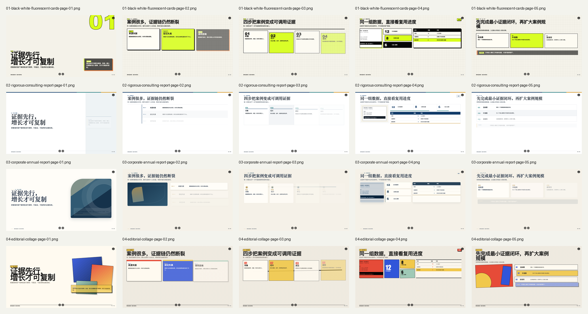
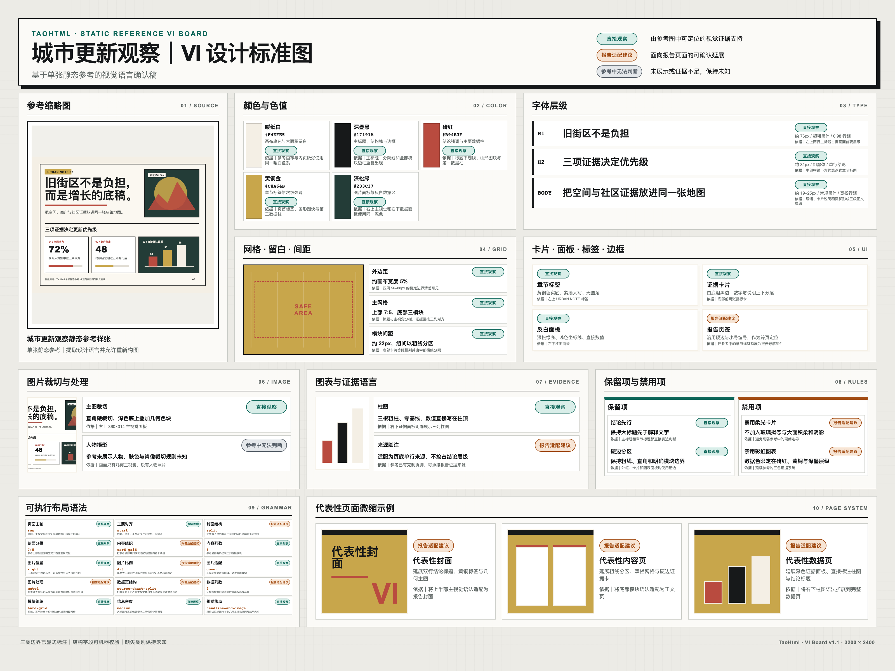
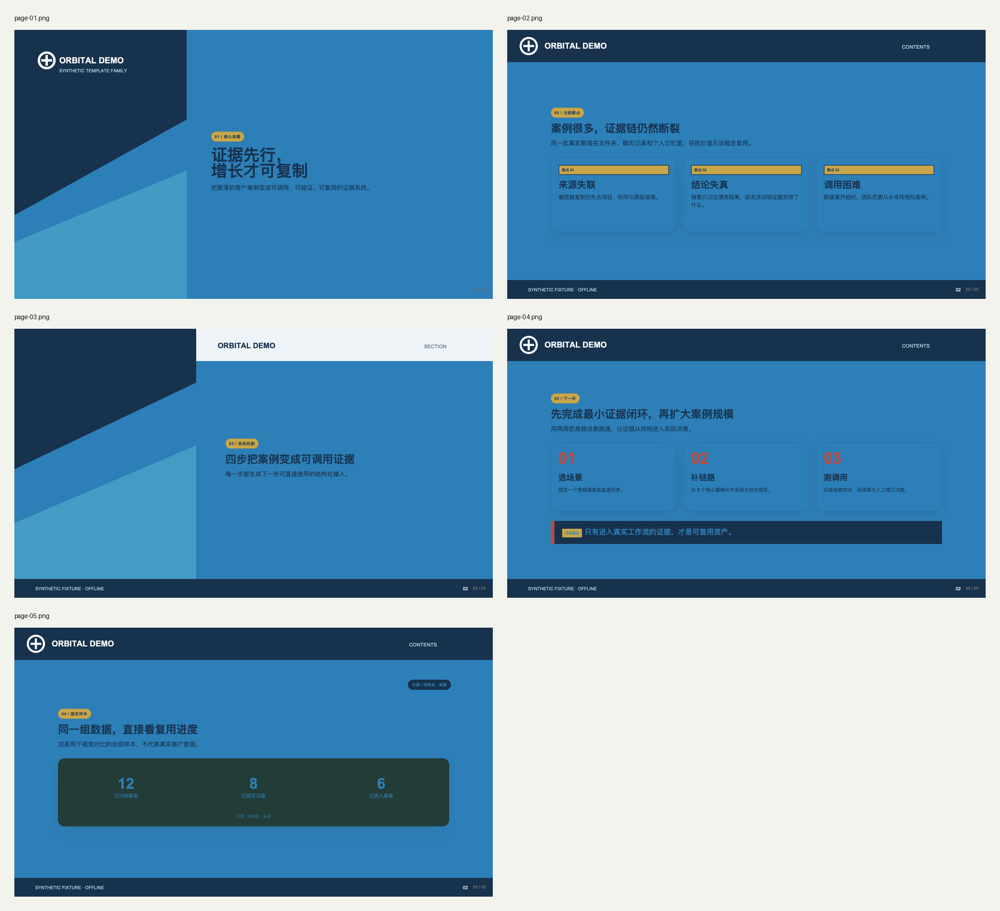

# TaoHtml

把已有的 Word、PDF 或 PPT，直接制作成可在浏览器中汇报、带分步动效、支持全屏展示与离线交付的 16:9 HTML 演示文稿。它不只是转换文件格式，还会重新设计页面、视觉层级和讲解节奏，让成品可以直接用于项目汇报、客户提案、产品路演或培训。

如果你准备写报告、做汇报或制作提案，但目前只有一个主题、还没有完整思路，TaoHtml 也可以通过少量关键问题，帮助你梳理目标、受众、核心观点、证据和报告结构，再完成内容与演示设计。

如果你有喜欢的 PPT、网页或图片风格，可以把参考图发给 TaoHtml。它会拆解配色、字体层级、构图、组件和品牌元素，先生成一张 VI 设计标准图供你确认，再按照这套标准制作完整报告。企业模板还可以保留 Logo、页眉、页脚等固定品牌元素。

如果你没有明确的参考风格，可以直接选择四套内置视觉系统：黑白荧光卡片、严谨咨询报告、稳重企业年报、杂志图文拼贴，由 TaoHtml 根据报告内容完成重构与设计。

同一企业的模板第一次确认并通过主题验证后，可以保存为显式企业档案。后续项目精确匹配该企业时默认沿用 active version，不再重复读取参考图或生成同一份 VI；档案可检查、可回退、可导出导入，不依赖模型的隐式记忆。

> English brief: TaoHtml turns ideas and source material into polished, offline HTML reports and presentation-ready decks, with confirmed design decisions, reusable visual systems, and delivery QA.

当前版本：[`0.4.0`](https://github.com/TaoGEO/TaoHtml/releases/tag/v0.4.0) · [完整更新历史](CHANGELOG.md) · [工作流说明](docs/workflow.md)

## 核心能力

- 支持只有想法、Word / PDF、已有 PPT / HTML 三类入口；有明确绑定材料的路线先确认当前材料理解，idea-only 不增加虚假的材料确认门。
- 每次新调用先建立本次入口：没有明确主题或绑定材料时只显示三个入口；短回答只绑定当前对话中 Agent 刚展示的选项，工作区旧文件不会被自动当成本次输入。
- 一次只补一个真正会改变设计结果的决策，并保持明确的提问上限；转换型报告还会核对真实、可执行的行动入口。
- 在正式制作前确认《报告设计简报》，记录受众、目标、结构、证据、视觉来源和必要边界。
- 内置四套可执行视觉系统，不只更换配色，还会改变构图、层级、组件、图片、图表、证据和动效语法。
- 支持“参考风格重构”和“企业模板保真”：先生成可查看的 VI 设计标准图，确认后再编译项目专用主题。
- 企业模板保真结果可保存到 `${TAOHTML_HOME:-~/.taohtml}` 的版本化企业档案；同一企业后续项目自动绑定 active version，支持本次临时更换、永久升级、回退、归档和严格 export/import。
- 共享 HTML Runtime 支持阅读 / 演讲模式、分步呈现、整页导航、页状态保存、全屏和页码；“更多 → 编辑模式”可在同一会话中修订报告文字、替换图片、调整裁切焦点并导出新 HTML。
- 采用“报告产出优先”合同：普通信息缺口可以形成创作性补全，先交付可用报告，再附结构化《待核实内容清单》；真实来源和高风险事实继续失败关闭。
- 使用本地资产和相对路径，并执行离线资源检查、浏览器 QA、截图总览和 zip 打包。
- 按实际能力运行 `core / pdf / static-reference / browser` 环境预检；客户参考链会真实启动 Chromium 并截取最小截图，失败时在读取素材前停止。
- 用当前任务授权状态区分材料摘要、VI 与设计简报等确认产物，并核对任务本地文件的当前 SHA-256；适用确认未完成或确认后文件已改变时，机器门禁禁止正式 HTML、浏览器 QA 和交付。
- 浏览器 QA 会拒绝演讲模式零受控步骤、页面未铺满实际画布，以及普通 HTML / SVG 图表文字碰撞；分离的 HTML 正常流布局盒中的浅层字体度量交叠会单独记录，阅读模式可以合理地没有分步动效。

## 四套内置视觉系统

四套系统的对比使用完全相同的合成内容，各展示 5 页、共 20 页，便于直接比较完整的版式语言，而不是被选题差异干扰；即使不查看下方总览图，也可以通过表格了解各自的画面特征。

| 视觉系统 | 适合的画面语言 |
|---|---|
| **黑白荧光卡片** | 高反差、模块卡片和大标题，适合路演与强表达 |
| **严谨咨询报告** | 白底、结论式标题、高信息密度和严谨图表 |
| **稳重企业年报** | 稳重配色、图文平衡、品牌化版面和适度留白 |
| **杂志图文拼贴** | 图片切片、错位排版、大字标题和编辑杂志感 |

<a href="docs/assets/readme/v0.3.0/built-in-visual-systems.png"></a>

## 使用客户参考图

这两条路线共享“静态参考 → VI 设计标准图 → 当前版本确认 → 项目专用主题”的确认链，但保真目标不同。下方全部使用仓库自制、无真实品牌的合成样例。

项目专用主题不是第五套内置主题，默认只服务于当前项目；只有经过企业模板保真确认、hash-bound handoff、编译和 loader 验证的结果，才能另存为企业档案版本。两种路线都只承诺截图中可见效果：不重绘 Logo，内容进入可编辑安全区；动效由 Runtime 和报告任务决定，不从一张或多张静态图推断。

<table>
  <tr>
    <td width="50%" valign="top">
      <strong>参考风格重构</strong><br>
      接受 1 张静态参考图，提取可观察的颜色、字体层级、构图、组件和证据语言；允许为了报告内容重新组织页面，不把静态图推断成动效规则。<br><br>
      <a href="docs/assets/readme/v0.3.0/reference-style-reconstruction.png"></a>
    </td>
    <td width="50%" valign="top">
      <strong>企业模板保真</strong><br>
      接受同一模板族 1–3 张静态截图，锁定截图中可见的 Logo、页眉、页脚、品牌条和固定装饰，并把新内容限制在各页面角色的安全区。<br><br>
      <a href="docs/assets/readme/v0.3.0/corporate-template-fidelity.png"></a>
    </td>
  </tr>
</table>

企业模板保真只承诺截图中可见的像素与页面角色，不宣称恢复原始 PPT 母版、矢量 Logo、字体源文件、截图外资产或动效。可查看仓库中的[完整五页 HTML 样例](examples/corporate-template-fidelity/corporate-fidelity-sample.html)和[高清 VI 标准图](examples/corporate-template-fidelity/reference-vi-board.png)。

## 企业模板档案与跨项目复用

TaoHtml 会先从当前材料和对话解析企业身份，再与显式档案做精确匹配。唯一匹配时直接生成当前任务的 `profile-use` binding，并简短告知“本次沿用【企业模板 vN】；如需更换请直接说明”；不会把“是否复用”变成固定问卷。多个候选、身份不明确或本次需求与档案冲突时才问一个选择问题，禁止跨企业混用。

- “这次不用 / 这次换一个”只写入临时 override，不修改 active version。
- “以后改用 / 更新公司模板”重新走企业 VI 确认，创建 v2/v3 并原子切换 active pointer；旧版本保留可回退。
- “这是另一家公司 / 客户”创建或选择独立档案，不覆盖原企业。
- v1 不做破坏性删除；`archive` 只停止自动解析，`restore` 可恢复同一 active version。

档案优先使用 `TAOHTML_HOME`，默认 `~/.taohtml`，不写入 Skill 安装目录。它只保存企业品牌/模板所需的 VI 合同、参考图、经现有 loader 验证的 theme、确认边界与完整 hashes，不保存报告正文、项目目标、受众、证据或客户报告数据。本机多个 Agent 可指向同一目录；跨设备或无持久磁盘环境使用完整档案包 export/import，TaoHtml 不声称自动云同步。

每次 binding 都会再次验证 profile/version、VI、参考图、theme fingerprint 和来源边界。任何漂移、损坏、active version 变化或企业身份变化都会失败关闭，不能静默回退到四套内置系统。历史 binding 只替代“本次重新生成 VI”，仍必须确认当前《报告设计简报》，并通过 production authorization、浏览器 QA 和交付门禁。

## 安装入口

`skill/taohtml` 是唯一的 Agent 执行规则真源；Skill Hub 的中文概述由本 README 确定性生成，安装包内的执行 reference 也从该真源生成。README 截图只属于仓库文档，不复制进 Skill Hub 包或 Agent 执行上下文。Codex、Claude Code、Skill Hub 和离线安装包都从同一执行真源分发。

### 依赖声明与环境预检

技能根目录中的 `requirements.txt` 会随原始 Skill、marketplace 和 Skill Hub 包一起分发，但“包内声明依赖”不等于平台已经自动安装。`scripts/preflight.py` 只检查当前 Python、工作区、模块和 Chromium 真实启动能力，不安装依赖，也不改变托管环境。

在允许自行管理 Python 环境的平台，可从技能根目录执行：

```bash
python -m pip install -r requirements.txt
python -m playwright install chromium
python scripts/preflight.py --profile static-reference --workspace /path/to/workspace
```

托管平台若不允许安装，应修复或更换运行环境。企业模板保真和参考风格重构使用同一条 Pillow / Playwright / Chromium 链：预检失败后，只能修复/更换环境再重试，或明确放弃客户参考路线、改用四套内置视觉系统；不能用“手工企业保真”绕过，也不能把参考风格重构当成技术降级。Windows 当前只有 GitHub Actions `windows-latest` 冒烟验证，不代表支持所有 WorkBuddy Windows 环境。

### Skill Hub

在 Skill Hub 的 TaoHtml 详情页按平台入口安装或更新。渠道包中的中文概述、Agent 执行 reference、依赖声明、预检脚本和版本号会作为同一版本一起打包；升级后请以详情页和安装结果显示的版本为准。安装完成后，每次调用 TaoHtml，Agent 都必须先完整读取同一渠道包内的 `references/agent-workflow.md`，再开始分析或操作；包内 `requirements.txt`、`references/...`、`scripts/...` 与 `assets/...` 均从技能根目录解析，用户无需手动打开或加载这些文件。仓库中的版本准备不会自动发布或覆盖 Skill Hub 正在审核的公共版本；渠道审核状态以 Skill Hub 页面为准。

### Claude Code：GitHub marketplace

```bash
claude plugin marketplace add TaoGEO/TaoHtml
claude plugin install taohtml@taohtml
```

更新时执行：

```bash
claude plugin marketplace update taohtml
claude plugin update taohtml@taohtml
```

### Codex / 其他 Agent：原始 Skill

下载或 clone 本仓库后，将整个 [`skill/taohtml`](skill/taohtml) 目录安装为 `taohtml`。Codex 当前用户级 Skill 目录是 `$HOME/.agents/skills`；首次安装示例：

```bash
source="$PWD/skill/taohtml"
target="$HOME/.agents/skills/taohtml"
mkdir -p "$(dirname "$target")"
test ! -e "$target" || { echo "Target already exists: $target" >&2; exit 1; }
cp -R "$source" "$target"
```

更新时先备份本地修改，再完整替换旧目录，避免遗留已删除文件或生成 `taohtml/taohtml` 嵌套目录。不同 Agent 的安装目录和调用语法可能不同；Codex 中请显式使用 `$taohtml`。

### Release ZIP：离线 / 手动安装

[`taohtml-marketplace-v0.4.0.zip`](https://github.com/TaoGEO/TaoHtml/releases/download/v0.4.0/taohtml-marketplace-v0.4.0.zip) 同时包含 Codex 与 Claude Code 的本地 marketplace manifest，版本固定为 `0.4.0`。ZIP 不会自动接收更新；升级时需要完整替换解压目录并重新安装。GitHub Release、Skill Hub 与 ClawHub 是独立分发渠道；请以各渠道公开详情页显示的版本为准。

## 版本更新

README 只保留每版最重要的用户变化；完整逐条历史见 [CHANGELOG](CHANGELOG.md)。

| 版本 | 最重要的变化 | 版本页与完整记录 |
|---|---|---|
| **v0.4.0** | 新增轻量离线内容编辑器：可修改报告文字、替换图片、调整裁切焦点、撤销/重做、刷新恢复并导出新的 HTML；版式、图表数据和动效仍由 Agent 处理 | [GitHub Release](https://github.com/TaoGEO/TaoHtml/releases/tag/v0.4.0) · [CHANGELOG](CHANGELOG.md#040---2026-07-17) |
| **v0.3.3** | 企业模板在首次 VI 确认后可存为显式版本档案；后续项目精确匹配时自动沿用，并支持临时更换、永久升级、回退和完整迁移 | [GitHub Release（发布后生效）](https://github.com/TaoGEO/TaoHtml/releases/tag/v0.3.3) · [CHANGELOG](CHANGELOG.md#033---2026-07-17) |
| **v0.3.2** | 新调用入口握手与材料来源绑定；按能力运行的快速环境预检；技能包自带依赖声明与 Windows 冒烟验证 | [GitHub Release（发布后生效）](https://github.com/TaoGEO/TaoHtml/releases/tag/v0.3.2) · [CHANGELOG](CHANGELOG.md#032---2026-07-16) |
| **v0.3.1** | Skill Hub 概述改为与 GitHub README 同源的中文纯文字客户介绍；Agent 执行规则改由同包 reference 承载，能力边界不变 | [GitHub Release（发布后生效）](https://github.com/TaoGEO/TaoHtml/releases/tag/v0.3.1) · [CHANGELOG](CHANGELOG.md#031---2026-07-16) |
| **v0.3.0** | 四套可执行视觉系统与同内容样张；参考风格重构 / 企业模板保真及项目主题编译；报告产出优先 + 《待核实内容清单》与质量基准 | [GitHub Release（发布后生效）](https://github.com/TaoGEO/TaoHtml/releases/tag/v0.3.0) · [CHANGELOG](CHANGELOG.md#030---2026-07-16) |
| **v0.2.0** | Word / PDF 材料理解到离线 HTML 的首个完整闭环；阅读 / 演讲 Runtime 与三档浏览器 QA；单一 Skill 真源与跨客户端离线包 | [GitHub Release](https://github.com/TaoGEO/TaoHtml/releases/tag/v0.2.0) · [CHANGELOG](CHANGELOG.md#020---2026-07-15) |
| **v0.1.0** | 建立明确版本、仓库质量工作流与可移植资产检查；补齐 hash 路由、分步内容和来源弹窗的基础浏览器 QA | [Git tag](https://github.com/TaoGEO/TaoHtml/tree/v0.1.0) · [CHANGELOG](CHANGELOG.md#010---2026-07-13) |

> v0.1.0 当时只创建了 Git tag，没有独立 GitHub Release；这里不生成一个并不存在的 Release 链接。

## 作者与合作

TaoHtml 由 Tao 发起，用于探索 AI Agent 如何参与高质量 HTML 课件、路演报告和证据型汇报的生产。

如果你对以下方向感兴趣，可以联系我：

- 企业汇报 / 路演课件 HTML 化
- AI Agent skill 定制
- 高设计感商业报告与演示系统
- GEO / 内容工程 / 知识库相关报告系统

微信：`taomir`
