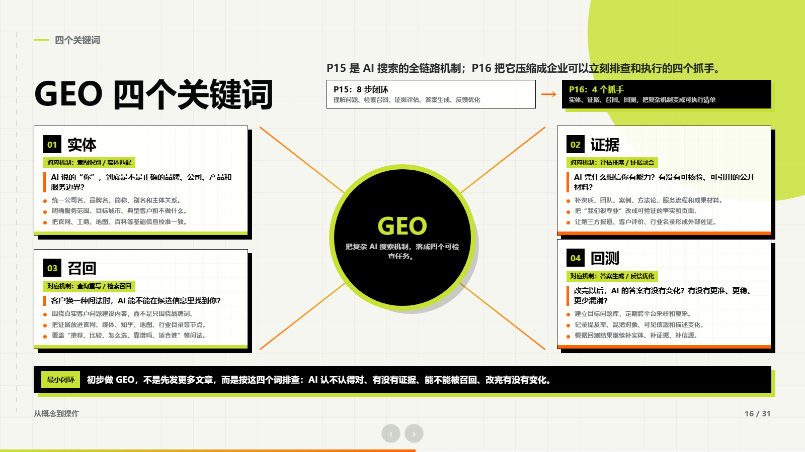
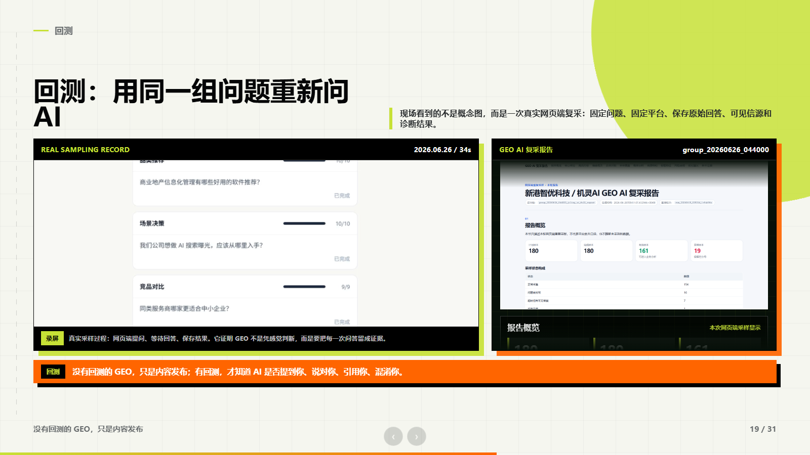

# 案例拆解：GEO 沙龙路演 HTML

## 项目背景

这是一套用于线下沙龙的 GEO 路演课件。原始输入不是一份完整 PPT，而是多个分散材料：

- 沙龙主题和五段式内容框架。
- 活动海报和视觉参考。
- AI 问答截图、真实采样截图、复采报告和视频录屏。
- GEO 服务任务盘、报价图和转化页需求。
- 后续演讲训练需要的逐页口播稿。

目标不是“把材料排漂亮”，而是做成一套能在现场讲清楚、能展示真实证据、能自然转入服务介绍的 HTML Presentation。

## 设计目标

这套课件的核心判断是：

> AI 已经变成客户的第一轮顾问。企业做 GEO，不是多发文章，而是让 AI 能认对你、找到证据、召回材料，并通过回测确认答案是否真的变化。

围绕这个判断，课件被重构成四段：

1. 客户行为已经变化：客户不只搜关键词，而是在问 AI 判断题。
2. GEO 的底层机制：从 SEO 的链接排名，转向 AI 答案里的实体、证据、召回和回测。
3. 系统化工程：GEO 不是一篇文章，而是一套任务盘、证据库、分发和复查流程。
4. 服务转化：把复杂认知收口为诊断、建设、分发、复查的商业入口。

## 视觉系统

案例采用海报式高反差视觉：

- 黑白高反差作为主基调。
- 荧光黄绿色作为技术和重点提示色。
- 橙色用于风险、警告、结论。
- 网格、细线标尺、点阵、圆弧切面作为全篇统一元素。
- 大标题、短句、证据窗口和报告切片形成现场演讲节奏。

这不是只复刻配色，而是把海报的设计 DNA 迁移到整套课件：大标题压迫感、黑色信息块、荧光强调、工程化证据窗口、分步展开和报告面板。

## 关键页面

### AI 搜索机制


这一页把 AI 搜索拆成完整链路：用户提问、意图识别、查询重写、检索召回、候选内容评估、证据融合、答案生成和反馈优化。它承担“把概念变成机制”的任务。

### GEO 四个关键词



上一页机制很完整，但现场不适合让观众记住八步。因此这里进一步压缩成四个可执行抓手：实体、证据、召回、回测。页面采用放射式构图，把中心概念和四个操作点连起来。

### AI 如何检索证据并召回


这一页用真实问题场景演示 AI 的处理过程：它不是直接写答案，而是先判断用户到底想问哪家机构，再做实体消歧、检索重写、证据召回和融合生成。页面可以分步展开，适合演讲者逐步解释。

### 回测与复采



这一页把真实采样录屏和复采报告放在同一页，说明 GEO 需要回测。没有回测，就不知道 AI 是否提到你、说对你、引用你，还是继续混淆你。

## TaoHtml 在这个案例里做了什么

- 从“内容框架”推导演讲主线，而不是直接生成页面。
- 把原始截图、报告和视频拆成证据页，保留可信来源。
- 把鼠标点击交互改成翻页器友好的串行展开。
- 为复杂页面设计了机制图、放射图、证据流程图、报告面板和视频弹窗。
- 统一视觉系统，避免每页像不同模板拼接。
- 输出完整口播稿，方便演讲者练习。
- 检查本地素材路径和 1600x900 展示效果，保证可交付。

## 为什么不直接公开完整 HTML

完整商业版课件包含活动报名二维码、联系电话、报价页、真实业务资料和部分本地采样材料。开源仓库目前只放脱敏截图和方法拆解，避免把不必要的商业细节公开。

如果你希望把自己的项目做成类似案例，可以把 PDF、截图、视频、报告和大纲提供给 Codex，并使用 TaoHtml 作为工作流约束。

## 可复用提示词

```text
使用 $taohtml，帮我把这套材料做成一个高设计感 HTML 路演课件。

这不是普通 PPT 美化。请先判断：
1. 观众看完后应该相信什么？
2. 哪些真实截图、报告、视频、案例必须作为证据出现？
3. 哪些页面需要做成机制图、流程图、对比页、案例拆解或现场演示？
4. 哪些内容适合放主页面，哪些内容应该放证据弹窗或附录？

设计要求：
- 统一视觉系统，不要每页换模板。
- 保留真实证据的可读性。
- 交互要适合翻页器：右键或点击按顺序展开，展开完成后再进入下一页。
- 本地 HTML、相对路径、可离线打开。
- 交付前检查 1600x900 尺寸、素材路径、页码、进度条和视频播放。
```
