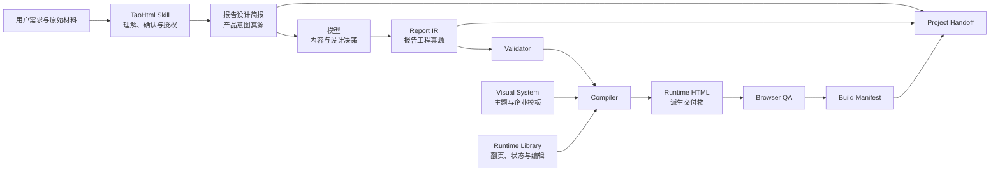

# Report IR v0 研究总纲

> 状态：研究基线，不是 TaoHtml 当前生产合同<br>
> 范围：概念模型、代表性样例、可行性实验与 Go / No-Go 判断<br>
> 不包含：正式 Schema、生产 Compiler、Runtime 改造、Handoff 真源迁移和版本发布

## 目录

- [1. 研究结论](#1-研究结论)
- [2. 当前合同与目标架构](#2-当前合同与目标架构)
- [3. 产品定位](#3-产品定位)
- [4. 数据所有权与层级边界](#4-数据所有权与层级边界)
- [5. Report IR v0 概念模型](#5-report-ir-v0-概念模型)
- [6. 模式系统](#6-模式系统)
- [7. 证据与待核实内容](#7-证据与待核实内容)
- [8. 页面、视觉与动效意图](#8-页面视觉与动效意图)
- [9. Compiler 与 Runtime 边界](#9-compiler-与-runtime-边界)
- [10. 修改、版本与失效传播](#10-修改版本与失效传播)
- [11. 三个研究样例](#11-三个研究样例)
- [12. Token 与质量实验](#12-token-与质量实验)
- [13. Go / No-Go 门槛](#13-go--no-go-门槛)
- [14. 明确延后](#14-明确延后)
- [15. v0 交付清单](#15-v0-交付清单)

## 1. 研究结论

### 产品原则

TaoHtml 值得研究 Report IR，但只有在下列目标成立时才值得进入生产：

> 模型生成可验证的报告语义与设计意图，本地 Compiler 确定性生成 HTML；模型不再重复生成完整 HTML。

目标架构只维护一套公开语义 IR，不为路演、可研、经营分析、培训或年报分别建立互不兼容的格式。

### 技术建议

允许 Compiler 内部存在不对外承诺兼容的派生表示：

```text
Report IR
→ Normalized IR
→ Resolved Layout Plan
→ Runtime Manifest
→ HTML
```

这些内部表示由确定性程序生成，不由模型输出，也不进入 Project Handoff 的长期兼容承诺。

### 待验证假设

1. Report IR 能显著减少首次生成和后续修改的 Token。
2. 稳定实体 ID 能把大多数修改限制在页面、内容块或证据依赖的局部范围。
3. 同一 IR 能在至少两套 TaoHtml 视觉系统中合理呈现。
4. IR 能提高较弱模型的结构稳定性，同时不明显降低强模型的视觉创造力。
5. 常见 TaoHtml 页面无需嵌入任意 HTML、CSS 或 JavaScript 也能表达。

这些假设未经过对照实验，不得写入当前产品能力说明。

## 2. 当前合同与目标架构

### v0 期间保持不变

- 客户确认的《报告设计简报》仍是产品意图真源。
- 设计简报保持客户可读，不新增需要客户阅读或确认的 JSON 配置。
- 当前主要报告源仍是 HTML。
- `report_ir_ref` 与 `compiler_version` 仍只是 Project Handoff 中的未来预留引用。
- 浏览器编辑器继续导出新 HTML，不宣称修改会回写 Report IR。
- 当前生产授权、企业模板、Runtime、QA 和交付流程不改变。

### 目标架构



### 迁移原则

Report IR v0 只使用固定研究样例，不进入每一个真实客户任务。

只有 Go / No-Go 门槛全部通过后，才讨论：

1. 把 Report IR 提升为唯一报告工程源；
2. 把 HTML 从“主要报告源”调整为“当前交付与运行产物”；
3. 修改 Project Handoff 的真源、版本和哈希关系；
4. 让浏览器编辑输出可合并回 IR 的 Patch。

## 3. 产品定位

Report IR 最准确的定位是：

> 可重新编译、可局部修改、可追溯的报告工程源文件。

它同时承担：

- 报告语义中间表示；
- Compiler 输入；
- 内容、证据、页面和动效之间的稳定引用层；
- 未来项目续作、迁移和回退的工程源。

Report IR 不是：

- 客户需求问卷；
- 《报告设计简报》的重复副本；
- 固定 PPT 章节模板；
- 固定卡片或版式模板；
- HTML DOM 描述；
- CSS、JavaScript 或动画库配置；
- 自动证明模型内容正确的事实核验系统；
- 当前阶段的 Workspace、数据库或协作服务。

## 4. 数据所有权与层级边界

| 层 | 拥有的数据 | 是否为真源 |
|---|---|---|
| 原始材料 | 客户文件、真实数据、截图、附件和外部来源 | 原始资料真源 |
| 报告设计简报 | 目标、受众、范围、章节方向、视觉选择和确认边界 | 产品意图真源 |
| Report IR | 报告内容、结构、证据关系、页面投影和表达意图 | 目标报告工程真源 |
| Visual System | 令牌、版式能力、组件语法、企业固定壳和降级规则 | 视觉实现真源 |
| Compiler | 验证、映射和构建规则 | 不保存项目内容 |
| Runtime | 翻页、页面状态、编辑和离线运行行为 | 运行行为真源 |
| HTML | 当前构建的可阅读、汇报和演讲产物 | 派生交付物 |
| QA | 对精确构建产物的验证结果 | 构建质量记录 |
| Project Handoff | 真源、构建物、版本、哈希和未解决项的索引 | 交接索引 |

### 设计简报与 IR 的边界

设计简报回答：

- 为什么做；
- 给谁看；
- 希望产生什么结果；
- 哪些观点和边界已经确认；
- 采用什么视觉与交付方向。

Report IR 回答：

- 具体讲什么；
- 内容如何组织和复用；
- 哪个观点由什么支撑；
- 如何投影为页面；
- 页面状态与讲解如何推进。

IR 只保存设计简报的稳定引用、哈希和必要约束，不复制完整沟通过程。

## 5. Report IR v0 概念模型

### 三个平面

#### 语义内容平面

- Report
- Chapter
- Narrative Unit
- Content Block
- Claim
- Evidence
- Evidence Link
- Source
- Dataset
- Asset

#### 交付投影平面

- Projection
- Page
- Visual Intent
- State Sequence
- Speaker Notes
- Appendix

#### 构建与追踪平面

- Design Brief Binding
- Theme Binding
- Runtime Profile
- Traceability
- Revision
- Build Compatibility

### 核心实体

| 实体 | 责任 | v0 必需性 |
|---|---|---|
| Report | 报告身份、目标、受众和全局模式 | 必需 |
| Chapter | 组织叙事阶段 | 必需 |
| Narrative Unit | 与页面无关的叙事或知识单元 | 必需 |
| Projection | 定义当前主要阅读或演讲投影 | 必需一个 |
| Page | 把 Narrative Unit 投影为具体页面 | 必需 |
| Content Block | 保存可复用语义内容 | 必需 |
| Claim | 保存事实、推论、假设、建议等表达 | 有判断时必需 |
| Evidence | 保存支撑、限制或反驳 Claim 的材料 | 按严谨度和边界要求 |
| Evidence Link | 描述 Claim 与 Evidence 的关系 | 有证据时必需 |
| Source | 保存来源身份、可用状态和核验状态 | 有来源时必需 |
| Dataset | 保存数据范围、口径和转换血缘 | 有数据图表时必需 |
| Asset | 保存图片、附件等可定位素材 | 按项目需要 |
| Visual Intent | 描述视觉重点、顺序和内容关系 | 每页必需最小版本 |
| State Sequence | 描述页面初始、分步和最终状态 | 有分步表达时必需 |
| Speaker Notes | 绑定页面或状态的口播内容 | 按演讲需要 |
| Appendix | 方法、来源、完整数据和补充内容 | 可选 |
| Traceability | 记录来源、修改和构建依赖 | 必需 |

### Narrative Unit 是关键抽象

Narrative Unit 表示一段独立的叙事任务或知识单元，而不是一页。

例如：

```text
章节：市场机会

Unit A：市场总量正在增长
Unit B：增量集中在企业服务
Unit C：增长受渠道能力限制
```

当前演讲投影可以把三个 Unit 组织为四页；未来阅读投影可以组织为两页。Claim、Evidence 和 Source 不因此复制。

### Content Block 使用语义命名

v0 候选类型：

- headline
- body_text
- claim
- metric
- data_visualization
- table
- image
- quote
- list
- process
- comparison
- timeline
- evidence_excerpt
- methodology
- caveat
- call_to_action

禁止使用 `blue_card`、`left_box`、`neon_panel` 等视觉命名。卡片、颜色、圆角和几何位置属于主题实现。

### v0 不变量

1. 所有稳定 ID 唯一。
2. 所有引用可解析，不能存在悬空 Claim、Evidence、Source、Block 或 Page。
3. 每个 Page 只有一个明确的主要任务。
4. 每个 Narrative Unit 说明它在整体叙事中的作用。
5. Source 可访问状态与事实核验状态必须分开。
6. 每个 Evidence Link 明确支持、限制、反驳还是补充背景。
7. 阅读最终状态包含该页面承诺给读者的全部信息。
8. Speaker Notes 绑定的 Page 或 State 必须存在。
9. IR 不得包含可执行 HTML、CSS、JavaScript 或远程脚本。
10. 未知必需扩展没有明确 fallback 时必须失败。

## 6. 模式系统

只建立一套核心 IR，通过独立维度组合。

| 维度 | 所属层 | 说明 |
|---|---|---|
| report_archetype | Report | 路演、可研、经营分析、培训、年报等语义原型 |
| evidence_rigor | Report，可章节覆盖 | 探索、标准、正式的证据处理要求 |
| delivery_mode | Projection | reading 或 presentation |
| information_density | Projection，可页面覆盖 | low、medium、high |
| motion_density | Projection | 页面状态变化的频率 |
| interaction_level | Projection | 图表、表格和探索交互能力 |
| state_complexity | Projection，可页面覆盖 | 固定、分步、重排或完整场景变化 |
| theme_ref | Build Binding | 四套内置主题或项目专用主题 |
| enterprise_binding | Build Binding | 当前企业档案或企业保真项目主题引用 |

### 客户界面保持简单

客户仍只选择“少量 / 适中 / 丰富”的动效密度。模型或规范化步骤可在 IR 内部拆解 `motion_density`、`interaction_level` 和 `state_complexity`，不得把内部字段重新变成客户问卷。

### v0 投影边界

v0 每个样例只建立一个主要 Projection，并记录阅读最终状态。

暂不研究同一项目中分页和章节都完全不同的多 Projection 自动转换。

## 7. 证据与待核实内容

### 证据图

```text
Claim
  ← Evidence Link →
Evidence
  → Source / Dataset / Asset
```

Evidence Link 至少表达：

- supports：支持；
- limits：限制适用范围；
- refutes：反驳；
- contextualizes：提供背景；
- qualifies：增加条件或限定。

### Claim 类型

- fact
- inference
- assumption
- recommendation
- definition
- simulation
- opinion

### 来源状态不能合并

至少分别记录：

- 来源身份和定位；
- 当前是否可访问；
- 是否检查过来源内容；
- 来源是否真正适配当前 Claim；
- 客户是否确认；
- 文件或数据哈希是否仍一致。

“文件存在”不等于“事实已核验”。

### 产出优先合同

Report IR 必须继续支持 TaoHtml 当前的 output-first 规则。

建议把内容状态区分为：

- source_fact：来自已绑定来源；
- customer_provided_unverified：客户提供、尚未外部核验；
- public_verified：公开来源已核验；
- creative_supplement：创作性补全；
- projected：推演内容或推演数字；
- illustrative：示意或模拟内容；
- conflicting：来源冲突；
- pending_verification：待客户核实。

普通场景、示例、推演数字、观点和表达缺口可以继续完成报告，并在交付时进入《待核实内容清单》。

下列硬边界不得被推演内容冒充：

- 真实客户或公司身份；
- 引语、文献、来源和引用；
- 已经实现的真实成果；
- 法律、医疗、财务、安全等高风险事实；
- 已确认的来源、数据和行动渠道。

模拟图表、虚构案例、生成的证据样式素材和容易被误认为真实证据的数据展示，还必须在页面相邻位置标注 `示意 / 模拟 / 待核实`。

### evidence_rigor 的含义

- exploration：允许较多推演，但必须保持来源状态和交付披露。
- standard：主要观点应有来源支撑，缺口可以作为明确的待核实推演完成。
- formal：事实与推论需要完整的来源关系；未核验内容可以作为假设、场景或推演存在，但不能伪装成已核验结论。

formal 不等于“材料不全就停止制作”。

## 8. 页面、视觉与动效意图

### 页面角色使用两个维度

修辞角色：

- orient
- assert
- prove
- explain
- compare
- synthesize
- decide
- act

页面形式：

- poster
- evidence
- data
- process
- framework
- comparison
- case
- matrix
- source
- closing

例如 `role=prove + form=data`，比“市场增长数据证明页”更通用。

### Visual Intent 只表达语义意图

可以表达：

- 主要和次要视觉焦点；
- 阅读顺序；
- 内容之间的支持、对比、包含和因果关系；
- 构图家族；
- 对称或非对称倾向；
- 信息密度；
- 证据应显性出现还是进入附录或来源入口；
- 哪些 Block 可以折叠、拆页或降级。

不得表达：

- 像素坐标；
- 具体 CSS 属性；
- 任意 DOM；
- 动画库名称；
- 主题专属颜色和卡片样式。

### State Sequence

每个状态可以描述：

- 当前可见 Block；
- 当前视觉焦点；
- Block 的语义位置变化，例如“从主焦点退到摘要区域”；
- 强调、缩小、展开、重组等意图；
- 对应口播节点；
- 最终阅读状态。

State Sequence 描述“画面为什么变化”，Runtime 和主题决定“具体怎样变化”。

### 避免重复卡片

Compiler 可以根据明确的版式能力、页面角色和邻页历史进行确定性变体选择，但不能重新理解自然语言后自由设计。

v0 需要验证：

- 连续页面能否在同一视觉系统中保持统一而不重复；
- 同一 Visual Intent 能否在两套主题中采用不同构图；
- 强模型提出的非标准视觉重点能否通过受约束意图表达，而不是退回任意 HTML。

## 9. Compiler 与 Runtime 边界

### 模型负责

- 报告讲什么；
- 章节和 Narrative Unit 的叙事关系；
- Claim、Evidence 和 Source 的绑定；
- 页面任务、角色和内容块；
- 视觉焦点、内容关系和状态意图；
- 口播稿和附录内容；
- 对 IR 做面向稳定 ID 的语义 Patch。

### Skill 负责

- 三种入口、有限提问和材料理解；
- 设计简报与 VI 确认；
- 制作授权和流程路由；
- 选择需要加载的 IR 参考、验证器和工具；
- 交付时提供《待核实内容清单》；
- 不把全部 IR 细节继续堆入 `SKILL.md`。

### Compiler 必须负责

- 版本、Schema 和引用验证；
- 语义不变量检查；
- 主题、企业模板和 Runtime 能力解析；
- Page、Block、Visual Intent 到主题组件的确定性映射；
- State Sequence 到 Runtime 状态的编译；
- 离线素材、字体和附件打包；
- IR 实体到 DOM 的 source map；
- Build Manifest 和构建诊断。

### Compiler 不能负责

- 重写、总结或删减报告观点；
- 发明证据、来源或数据；
- 修改事实状态和数据口径；
- 自行增加或删除章节；
- 调用模型补全内容；
- 因为排版困难而无限缩小字号；
- 静默修复语义错误；
- 执行 IR 中的任意 HTML、CSS 或 JavaScript。

### Visual System 负责

- 视觉令牌；
- 版式家族和组件语法；
- Page Role / Form / Visual Intent 的能力映射；
- 企业模板固定层与安全内容区；
- 动效意图的主题化实现和 fallback；
- 不支持组合的明确诊断。

### Runtime 负责

- 阅读与演讲模式；
- 页面和动效状态；
- 翻页、全屏和控制栏；
- 文字和图片编辑；
- 离线运行行为。

Runtime 不分析报告内容，也不决定证据、章节或页面任务。

### QA 负责

- IR 与 HTML 的实体追踪一致性；
- 核心观点、证据关系和来源标签是否丢失；
- 页面溢出、碰撞、遮挡和裁切；
- 动效状态、阅读最终状态和口播绑定；
- Runtime、编辑器和离线素材；
- 企业固定层、安全区和主题版本；
- 当前 QA 记录是否仍适用于当前输入哈希。

## 10. 修改、版本与失效传播

| 请求 | IR 操作 | 重新编译 | 主要失效项 |
|---|---|---|---|
| 修改第 7 页标题 | Patch 对应 Block | 第 7 页 | 页面与视觉 QA；语义改变时证据失效 |
| 第 7 页拆成两页 | 修改 Projection / Page | 两页及导航 | 页面、动效、口播和总览 QA |
| 全部换企业模板 | 修改 Design Binding | 全量 | 全部视觉与安全区 QA |
| 减少动效 | 修改 State Sequence / 密度 | 受影响页面 | 动效和口播同步 QA |
| 增加市场研究章节 | 新增 Chapter / Unit / Claim / Evidence | 新章节及导航 | 结构、证据和总体 QA |
| 替换一条数据证据 | 修改 Evidence / Source / Dataset 血缘 | 所有依赖页面 | Claim、图表、口播和附录 |
| 阅读稿改演讲稿 | 修改主要 Projection | 全量投影 | 页面、动效、口播和密度 QA |
| 只重做视觉 | 修改 Visual Intent 或 Theme Binding | 局部或全量 | 视觉、碰撞和动效 QA |
| 回退版本 | 恢复旧 Revision | 按旧版本构建 | 只有构建输入完全一致才可复用 QA |

修改是否需要重新确认《报告设计简报》，继续遵守现有“含义是否变化”规则，而不是由 IR 文件大小决定。

### 版本与兼容研究边界

v0 样例可以记录概念级版本字段，但不承诺生产兼容：

- `report_ir_version`：公开语义格式版本；
- `schema_version`：实际验证器版本；
- `compiler_version`：实际构建器版本；
- `runtime_version`：嵌入 HTML 的运行时版本；
- `theme_version`：当前主题或项目主题版本；
- `extension_version`：对应命名空间扩展版本。

建议由 Report IR 保存自身格式版本和所需能力，由 Build Manifest 记录本次构建实际使用的 Schema、Compiler、Runtime 和 Theme 版本。

兼容原则：

1. 核心对象默认封闭，未知核心字段报错，避免拼写错误被静默忽略。
2. 扩展只进入明确命名空间，不得携带可执行代码。
3. 不支持的可选扩展必须声明标准 fallback。
4. 不支持的必需扩展停止编译。
5. 迁移必须显式生成新 IR 和 Migration Log，不覆盖旧 IR。
6. 迁移无法确定语义时停止，不允许猜测。
7. 无法迁移的项目保留最后一次有效 HTML 和原 IR，标记为只读或归档。

### 依赖失效传播

- Source 字节、定位或核验状态变化：使相关 Evidence、Claim、图表、口播稿、附录和 QA 失效。
- Dataset 口径或转换变化：使所有派生 Evidence 和数据可视化失效。
- Claim 含义变化：使引用它的 Narrative Unit、Page、Speaker Notes 和设计简报确认边界待复核。
- Content Block 仅表达变化：至少使依赖页面和视觉 QA 失效；改变含义时继续向 Claim 和简报传播。
- Page 拆分、合并或重排：使导航、状态、口播、页面总览和浏览器 QA 失效。
- Theme 或企业模板版本变化：使全部视觉、安全区和碰撞 QA 失效，不自动使来源事实失效。
- Runtime 或 Compiler 版本变化：使全部构建与运行 QA 失效，不能复用旧 PASS。

### 高风险失败方式

- 把二手摘要、当前 HTML 或图表图片当成原始证据；
- 来源可访问，但其时间、地区、口径或方法并不支持当前 Claim；
- 修改正文后口播稿、附录或待核实清单仍保留旧内容；
- 替换数据后旧图表或旧结论继续存在；
- IR 已变更，但沿用旧 HTML、旧 Build Manifest 或旧 QA；
- 主题、企业模板、Runtime 或 Compiler 版本漂移；
- 自定义扩展通过 fallback 绕过必需语义验证；
- Compiler 静默删除无效字段或自动改写含义；
- IR 符合结构要求，但叙事、证据或页面语义错误。

这些风险必须通过引用完整性、来源适配、依赖图失效、精确哈希绑定、语义规则和浏览器 QA 共同控制。Schema 合法本身不等于报告正确。

### 浏览器编辑冲突

如果未来 IR 成为工程真源，浏览器导出的新 HTML 不能成为一个无法回写的分叉。

目标方向：

```text
Runtime 编辑
→ Runtime Patch
→ 绑定 base_ir_hash
→ 合并回 IR
→ 重新编译和 QA
```

v0 只研究 Patch 的最小语义和冲突边界，不修改当前编辑器。

## 11. 三个研究样例

### 样例 A：演讲型

[查看完整样例 A](report-ir-v0-sample-a-presentation.md)

- delivery_mode：presentation
- information_density：low
- motion_density：rich
- evidence_rigor：standard
- 视觉系统：黑白荧光卡片
- 重点：大标题、视觉焦点、状态重排、逐步口播

### 样例 B：正式阅读型

[查看完整样例 B](report-ir-v0-sample-b-formal-reading.md)

- delivery_mode：reading
- information_density：high
- motion_density：minimal
- evidence_rigor：formal
- 视觉系统：严谨咨询报告
- 重点：完整论证、方法、数据口径、限制和附录

### 样例 C：企业模板型

[查看完整样例 C](report-ir-v0-sample-c-corporate-fidelity.md)

- delivery_mode：presentation
- information_density：medium
- motion_density：medium
- evidence_rigor：formal
- 视觉系统：企业模板保真项目主题
- 重点：Logo、页眉页脚、品牌条固定，内容只进入安全区

### 样例共同要求

[查看三个样例的共同核心与差异复核](report-ir-v0-samples-comparison.md)

每个样例必须包含：

1. 一份已确认式设计简报样本；
2. 一份概念级 IR；
3. 至少一个 Claim—Evidence—Source 链；
4. 至少一个待核实或推演内容；
5. 至少三类 Page Role / Form 组合；
6. 至少一个与主要投影相符的状态实验：演讲投影使用多状态页面，阅读投影使用完整最终状态页面；
7. 同一语义映射到第二套视觉系统的手工实验；
8. 修改标题、拆页、换证据和换主题的 Patch 记录。

## 12. Token 与质量实验

### 对照架构

- A：模型直接生成完整 HTML；
- B：模型生成 IR，再由模型生成 HTML；仅用于证明重复生成的成本，不作为候选产品架构；
- C：模型生成 IR，本地 Compiler 生成 HTML。

### 测量内容

- 首次生成输入、输出和总 Token；
- 单页标题修改；
- 一页拆两页；
- 替换证据；
- 切换视觉系统；
- 改变动效密度；
- 新对话续作；
- 回退版本。

### 质量指标

- Schema 错误；
- 语义不变量错误；
- Claim 遗漏；
- Evidence 断链；
- 来源状态错误；
- 待核实内容丢失；
- 页面重复度；
- 浏览器 QA 问题；
- 人工修正次数；
- 视觉盲评；
- 与设计简报的一致性。

### 实验纪律

- 所有比例都标为估算或实测；
- 记录模型、版本、提示、输入材料、运行时间和 Token 计量方式；
- 控制器、评分规则和预期失败点不泄漏给执行模型；
- A 与 C 使用相同材料、设计简报和目标主题；
- 不在每轮对话重复输出完整 IR，按稳定 ID 加载和修改相关分片；
- B 不进入真实产品路线。

初期只使用三个样例，不立即扩展为十二项目乘三模型的大型矩阵。

## 13. Go / No-Go 门槛

Report IR v0 只有同时满足以下条件，才允许进入 v1 设计：

1. 常见页面不依赖任意 HTML、CSS 或 JavaScript 扩展。
2. 三个样例的核心语义、证据和待核实状态可以完整表达。
3. 同一 IR 至少能在两套视觉系统中合理呈现。
4. 企业固定层和安全内容区能够约束同一页面语义。
5. 标题修改、拆页、换证据和换主题能定位到稳定实体 ID。
6. IR Token 相比完整 HTML 有实质性下降。
7. 换主题基本不需要模型重新生成内容。
8. 较弱模型的结构与客观 QA 下限得到改善。
9. 强模型视觉盲评没有明显下降。
10. Validator 能阻止悬空引用、证据状态混淆和未知必需扩展。
11. Compiler 原型不需要调用模型或重新判断报告含义。
12. 当前 Runtime 和企业主题无需为单个样例硬编码特殊规则。

### No-Go 信号

出现以下任一情况，应暂停扩大范围：

- 大量典型页面必须绕过 IR 才能表达；
- IR Token 接近或超过直接生成的 HTML；
- 强模型输出明显退化为固定卡片组合；
- Compiler 必须理解自然语言才能完成基本布局；
- 每增加一个客户案例就要增加核心字段；
- 主题切换改变或丢失报告语义；
- 证据与待核实内容在投影或编译中丢失；
- 相同输入不能稳定产生相同构建结果。

## 14. 明确延后

- 正式 JSON Schema；
- 正式生产 Compiler；
- 多 Projection 自动转换；
- 高级 Composition Graph；
- 跨页连续动效；
- Runtime Patch 自动回写；
- IR 物理分片、增量编译和缓存；
- Workspace、云同步和团队协作；
- 第三方扩展市场；
- 账户、权限和在线项目服务。

## 15. v0 交付清单

### 阶段一：研究总纲

- 本文档；
- 核心词汇、边界和不变量；
- 三个样例与实验计划；
- Go / No-Go 门槛。

### 阶段二：概念样例

- [演讲型概念 IR](report-ir-v0-sample-a-presentation.md)；
- [正式阅读型概念 IR](report-ir-v0-sample-b-formal-reading.md)；
- [企业模板型概念 IR](report-ir-v0-sample-c-corporate-fidelity.md)；
- [共同语义和差异字段说明](report-ir-v0-samples-comparison.md)。

### 阶段三：验证记录

- 证据链与待核实内容检查；
- 两主题映射记录；
- Patch 与失效传播记录；
- Token 和质量对照数据。

### 阶段四：研究结论

- Go / No-Go 决定；
- Report IR v1 的最小范围；
- Handoff、编辑器和真源迁移影响；
- 仍需产品负责人决定的架构问题，最多五项。

进入阶段二前，本文只作为研究基线，不改变 TaoHtml 当前对客户承诺的能力。
