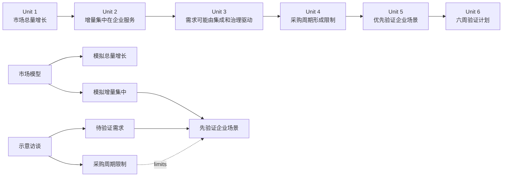

# Report IR v0 样例 A：演讲型市场机会报告

> 状态：概念样例，不是正式 Schema，也不是可交付市场研究<br>
> 主题：某企业知识服务产品的市场增长与进入策略<br>
> 主要投影：现场演讲<br>
> 视觉方向：黑白荧光卡片<br>
> 数据边界：全部研究数据和访谈均为本地模拟素材

## 目录

- [1. 样例目标](#1-样例目标)
- [2. 研究用设计简报摘要](#2-研究用设计简报摘要)
- [3. 报告语义地图](#3-报告语义地图)
- [4. 概念 IR](#4-概念-ir)
- [5. 关键页面状态](#5-关键页面状态)
- [6. 页面清单](#6-页面清单)
- [7. 第二主题映射假设](#7-第二主题映射假设)
- [8. Patch 实验](#8-patch-实验)
- [9. 初步验证结论](#9-初步验证结论)

## 1. 样例目标

这个样例只验证演讲型 Report IR 是否能够：

1. 把报告内容与页面分开；
2. 让一条 Claim 被数据、方法和访谈共同限制或支持；
3. 在页面文字较少时保留完整证据边界；
4. 描述会改变构图的分步状态，而不写 CSS 或动画库；
5. 绑定口播顺序与页面状态；
6. 把推演数据和示意访谈传递到页面标签与交付清单；
7. 通过稳定 ID 支持标题修改、拆页、换证据和换主题。

本样例不验证真实市场结论，也不进入 TaoHtml 当前生产流程。

## 2. 研究用设计简报摘要

### 项目定义

- 输入入口：只有想法；研究素材由固定本地 fixture 提供。
- 使用模式：现场演讲。
- 报告长度：精简，8 页。
- 受众：企业知识服务产品的内部决策团队。
- 目标：说明“市场总量增长不是主要判断，增量结构和验证路径才是决策重点”。
- 期望行动：批准一个六周的客户验证计划；这是内部决策，不需要外部网址或二维码。
- 视觉系统：黑白荧光卡片。
- 动效密度：丰富，但只在解释结构时使用。

### 必须保留的表达

1. 全部市场数字都是推演数据，不是真实市场预测。
2. 企业服务可能贡献主要增量，但结论依赖模拟假设。
3. 集成、权限治理和内容更新是待验证需求，不是已核验事实。
4. 建议先做六周验证，不建议直接把推演结果写成商业承诺。

### 来源与待核实边界

- 市场模型：Agent 生成的研究 fixture，文件可读，但只支持推演。
- 方法说明：解释指数和推演口径，不证明真实市场。
- 访谈摘要：Agent 生成的示意访谈，不代表真实客户反馈。
- 页面中的数字和访谈结论必须显示“推演 / 示意 / 待核实”。
- 交付清单必须列出市场指数、企业增量占比和六周计划假设。

## 3. 报告语义地图



### 章节与 Narrative Unit

| 章节 | Narrative Unit | 要回答的问题 | 叙事作用 |
|---|---|---|---|
| 看见机会 | `unit_total_growth` | 市场是否值得继续看 | 建立增长语境 |
| 看见机会 | `unit_growth_concentration` | 增长来自哪里 | 重构核心判断 |
| 解释机会 | `unit_enterprise_drivers` | 企业客户为什么可能需要 | 提出待验证机制 |
| 解释机会 | `unit_purchase_constraint` | 什么会限制机会 | 限制过度乐观结论 |
| 作出决定 | `unit_entry_priority` | 应优先验证什么 | 形成策略建议 |
| 作出决定 | `unit_six_week_plan` | 下一步具体做什么 | 推动内部行动 |

## 4. 概念 IR

以下 YAML 只展示概念结构，不承诺字段名称和序列化格式。

### 4.1 身份与模式

```yaml
identity:
  report_ir_version: research-v0
  report_id: report_enterprise_knowledge_opportunity
  revision_id: rev_001
  research_only: true

design_brief_binding:
  ref: report-ir-v0-sample-a-presentation.md#2-研究用设计简报摘要
  confirmation_status: simulated_for_research
  production_authorization: false

report:
  title: 增长不是均匀发生的
  objective: 为六周企业场景验证计划争取内部批准
  audience: 企业知识服务产品内部决策团队
  report_archetype: strategy_pitch
  evidence_rigor: standard
  primary_projection_ref: projection_presentation

projection_profiles:
  projection_presentation:
    delivery_mode: presentation
    information_density: low
    customer_motion_choice: rich
    motion_density: rich
    interaction_level: low
    state_complexity: staged_recomposition
    reading_final_state_required: true

build_binding:
  theme_ref: black-white-fluorescent-cards
  enterprise_binding: null
  runtime_profile: current_taohtml_single_screen
```

### 4.2 来源、数据与证据

```yaml
sources:
  source_market_model:
    locator: report-ir-v0-fixtures/sample-a/market-model.csv
    source_role: agent_generated_material
    availability: workspace_readable
    integrity:
      algorithm: sha256
      value: 77cb67923388107914b1bb33dcbb3772b9887a778b23e4c5a56711920d8d79a2
    content_status: illustrative
    evidence_verification: not_applicable
    limitation: 人工构造的市场模型，不能支持真实市场事实

  source_methodology:
    locator: report-ir-v0-fixtures/sample-a/methodology.md
    source_role: agent_generated_material
    availability: workspace_readable
    integrity:
      algorithm: sha256
      value: fc581f63410026023621fe89f500748c02fd753874850697f9fa5af6f9d3eec4
    content_status: illustrative
    evidence_verification: not_applicable
    limitation: 只解释模拟口径

  source_interview_summary:
    locator: report-ir-v0-fixtures/sample-a/interview-summary.md
    source_role: agent_generated_material
    availability: workspace_readable
    integrity:
      algorithm: sha256
      value: 305dca2b7e7c40ccc289e9471f44a6147de9f2b57f9ca70f88e667b4c386dadb
    content_status: illustrative
    evidence_verification: not_applicable
    limitation: 示意访谈，不代表真实客户反馈

datasets:
  dataset_market_projection:
    source_ref: source_market_model
    base_year: 2024
    base_index: 100
    time_range: 2024-2027
    transformation: 读取 fixture 中已经给出的指数与增量占比
    content_status: projected
    unit: index
```

```yaml
claims:
  claim_total_growth:
    kind: simulation
    statement: 模型中的市场总量指数从 100 增长到 142
    content_status: projected
    verification: not_applicable

  claim_growth_concentrated:
    kind: inference
    statement: 模型中的主要增量集中在企业服务细分市场
    content_status: projected
    verification: pending_verification

  claim_enterprise_drivers:
    kind: assumption
    statement: 集成、权限治理和持续更新可能是企业需求的主要驱动
    content_status: illustrative
    verification: pending_verification

  claim_purchase_constraint:
    kind: assumption
    statement: 较长采购周期可能限制短期转化
    content_status: illustrative
    verification: pending_verification

  claim_validate_enterprise_first:
    kind: recommendation
    statement: 先验证企业场景，再决定是否扩大投入
    content_status: creative_supplement
    verification: pending_verification

  claim_six_week_plan:
    kind: recommendation
    statement: 用六周完成需求、集成和采购路径验证
    content_status: creative_supplement
    verification: pending_verification
```

```yaml
evidence:
  evidence_total_index:
    source_refs: [source_market_model, source_methodology]
    dataset_ref: dataset_market_projection
    content_status: projected
    summary: 2024—2027 总量指数从 100 到 142

  evidence_enterprise_share:
    source_refs: [source_market_model, source_methodology]
    dataset_ref: dataset_market_projection
    content_status: projected
    summary: 2027 模型中的企业增量贡献占比为 64.3%

  evidence_simulated_interviews:
    source_refs: [source_interview_summary]
    content_status: illustrative
    summary: 示意反馈中，集成和权限治理被多次提及
```

```yaml
evidence_links:
  - claim_ref: claim_total_growth
    evidence_ref: evidence_total_index
    relation: supports
    claim_fit: valid_for_simulation_only

  - claim_ref: claim_growth_concentrated
    evidence_ref: evidence_enterprise_share
    relation: supports
    claim_fit: valid_for_simulation_only

  - claim_ref: claim_enterprise_drivers
    evidence_ref: evidence_simulated_interviews
    relation: supports
    claim_fit: illustrative_only

  - claim_ref: claim_purchase_constraint
    evidence_ref: evidence_simulated_interviews
    relation: contextualizes
    claim_fit: illustrative_only

  - claim_ref: claim_validate_enterprise_first
    evidence_ref: evidence_enterprise_share
    relation: supports
    claim_fit: recommendation_basis_only

  - claim_ref: claim_validate_enterprise_first
    evidence_ref: evidence_simulated_interviews
    relation: qualifies
    claim_fit: recommendation_requires_real_validation
```

### 4.3 章节与 Narrative Unit

```yaml
chapters:
  - id: chapter_opportunity
    task: 先证明机会值得看，再改变观众对增长来源的理解
    narrative_unit_refs:
      - unit_total_growth
      - unit_growth_concentration

  - id: chapter_mechanism
    task: 解释机会可能成立的原因与限制
    narrative_unit_refs:
      - unit_enterprise_drivers
      - unit_purchase_constraint

  - id: chapter_decision
    task: 把推演结论转成低风险验证行动
    narrative_unit_refs:
      - unit_entry_priority
      - unit_six_week_plan
```

```yaml
narrative_units:
  unit_total_growth:
    question: 市场是否值得继续看
    takeaway_ref: claim_total_growth
    claim_refs: [claim_total_growth]
    narrative_role: establish_context

  unit_growth_concentration:
    question: 增长究竟来自哪里
    takeaway_ref: claim_growth_concentrated
    claim_refs: [claim_growth_concentrated]
    prerequisite_refs: [unit_total_growth]
    narrative_role: reframe

  unit_enterprise_drivers:
    question: 企业客户为什么可能需要
    takeaway_ref: claim_enterprise_drivers
    claim_refs: [claim_enterprise_drivers]
    narrative_role: explain_mechanism

  unit_purchase_constraint:
    question: 什么可能限制机会
    takeaway_ref: claim_purchase_constraint
    claim_refs: [claim_purchase_constraint]
    narrative_role: qualify

  unit_entry_priority:
    question: 应优先验证什么
    takeaway_ref: claim_validate_enterprise_first
    claim_refs:
      - claim_growth_concentrated
      - claim_enterprise_drivers
      - claim_purchase_constraint
      - claim_validate_enterprise_first
    narrative_role: decide

  unit_six_week_plan:
    question: 下一步具体做什么
    takeaway_ref: claim_six_week_plan
    claim_refs: [claim_six_week_plan]
    prerequisite_refs: [unit_entry_priority]
    narrative_role: act
```

### 4.4 可复用 Content Block

```yaml
content_blocks:
  block_cover_title:
    type: headline
    content: 增长不是均匀发生的

  block_cover_subtitle:
    type: body_text
    content: 企业知识服务市场机会｜研究样例

  block_thesis_title:
    type: headline
    content: 增量比总量更重要

  block_growth_structure_title:
    type: headline
    content: 主要增量可能来自企业服务

  block_driver_title:
    type: headline
    content: 企业需求可能由三件事共同驱动

  block_constraint_title:
    type: headline
    content: 机会存在，但采购周期限制短期转化

  block_priority_title:
    type: headline
    content: 先验证最强需求，不先扩大投入

  block_plan_title:
    type: headline
    content: 六周只回答三个关键问题

  block_closing_title:
    type: headline
    content: 批准验证，而不是批准结论

  block_total_growth_metric:
    type: metric
    value: 42%
    label: 模拟总量指数增幅
    content_status: projected
    adjacent_label: 推演数据 / 待核实
    evidence_ref: evidence_total_index

  block_enterprise_share_metric:
    type: metric
    value: 64.3%
    label: 模拟企业增量贡献占比
    content_status: projected
    adjacent_label: 推演数据 / 待核实
    evidence_ref: evidence_enterprise_share

  block_segment_chart:
    type: data_visualization
    dataset_ref: dataset_market_projection
    chart_intent: compare_segment_growth
    content_status: projected
    adjacent_label: 推演数据 / 待核实

  block_driver_process:
    type: process
    items:
      - 系统集成
      - 权限治理
      - 内容持续更新
    content_status: illustrative
    adjacent_label: 示意需求 / 待核实

  block_purchase_caveat:
    type: caveat
    content: 示意访谈中存在较长采购周期风险
    content_status: illustrative
    adjacent_label: 示意访谈 / 待核实

  block_priority_matrix:
    type: comparison
    axes: [需求强度, 验证成本]
    primary_candidate: 企业知识治理场景
    content_status: creative_supplement

  block_validation_plan:
    type: process
    items:
      - 第 1—2 周：确认真实需求和角色
      - 第 3—4 周：验证集成与权限边界
      - 第 5—6 周：验证采购路径和决策条件
    content_status: creative_supplement
    adjacent_label: 建议计划 / 待确认

  block_action:
    type: call_to_action
    content: 批准六周验证，再决定扩大投入
```

### 4.5 Page Registry

每个 Projection 引用的 Page 都先具有最小可解析定义。第 3 页在下一节展开完整状态。

```yaml
pages:
  page_cover:
    narrative_unit_refs: []
    role: orient
    form: poster
    task: 建立主题、受众和研究样例边界
    title_block_ref: block_cover_title
    surface_block_refs:
      - block_cover_title
      - block_cover_subtitle
    state_count: 1

  page_thesis:
    narrative_unit_refs: [unit_growth_concentration]
    role: assert
    form: poster
    task: 先给出“增长结构比总量更重要”的判断
    title_block_ref: block_thesis_title
    primary_takeaway_ref: claim_growth_concentrated
    surface_block_refs:
      - block_thesis_title
      - block_enterprise_share_metric
    state_count: 2

  page_growth_structure:
    narrative_unit_refs:
      - unit_total_growth
      - unit_growth_concentration
    role: prove
    form: data
    task: 先确认总量增长，再把焦点转向增长结构
    title_block_ref: block_growth_structure_title
    primary_takeaway_ref: claim_growth_concentrated
    surface_block_refs:
      - block_growth_structure_title
      - block_total_growth_metric
      - block_segment_chart
      - block_enterprise_share_metric
    state_count: 3
    details_ref: document_section_5

  page_enterprise_drivers:
    narrative_unit_refs: [unit_enterprise_drivers]
    role: explain
    form: process
    task: 解释企业需求可能成立的机制
    title_block_ref: block_driver_title
    primary_takeaway_ref: claim_enterprise_drivers
    surface_block_refs:
      - block_driver_title
      - block_driver_process
    state_count: 4

  page_constraints:
    narrative_unit_refs: [unit_purchase_constraint]
    role: compare
    form: comparison
    task: 用采购周期限制过度乐观的增长判断
    title_block_ref: block_constraint_title
    primary_takeaway_ref: claim_purchase_constraint
    surface_block_refs:
      - block_constraint_title
      - block_enterprise_share_metric
      - block_purchase_caveat
    state_count: 2

  page_priority:
    narrative_unit_refs: [unit_entry_priority]
    role: decide
    form: matrix
    task: 选择优先验证的企业场景
    title_block_ref: block_priority_title
    primary_takeaway_ref: claim_validate_enterprise_first
    surface_block_refs:
      - block_priority_title
      - block_priority_matrix
    state_count: 3

  page_plan:
    narrative_unit_refs: [unit_six_week_plan]
    role: act
    form: process
    task: 把建议转成六周验证步骤
    title_block_ref: block_plan_title
    primary_takeaway_ref: claim_six_week_plan
    surface_block_refs:
      - block_plan_title
      - block_validation_plan
    state_count: 4

  page_closing:
    narrative_unit_refs: [unit_six_week_plan]
    role: act
    form: closing
    task: 请求内部批准并重申待核实边界
    title_block_ref: block_closing_title
    primary_takeaway_ref: claim_six_week_plan
    surface_block_refs:
      - block_closing_title
      - block_action
    state_count: 1
```

### 4.6 主要 Projection

```yaml
projection:
  id: projection_presentation
  delivery_mode: presentation
  page_order:
    - page_cover
    - page_thesis
    - page_growth_structure
    - page_enterprise_drivers
    - page_constraints
    - page_priority
    - page_plan
    - page_closing

  reading_behavior:
    same_page_order: true
    show_final_state: true
    animation_required: false

  presentation_behavior:
    advance_by_state: true
    speaker_notes_follow_state: true
    page_navigation_may_skip_remaining_states: true
```

## 5. 关键页面状态

第三页是本样例最重要的状态实验。

```yaml
page:
  id: page_growth_structure
  narrative_unit_refs:
    - unit_total_growth
    - unit_growth_concentration

  role: prove
  form: data
  task: 先确认总量增长，再把焦点转向增长结构
  primary_takeaway_ref: claim_growth_concentrated

  surface_block_refs:
    - block_growth_structure_title
    - block_total_growth_metric
    - block_segment_chart
    - block_enterprise_share_metric

  visual_intent:
    composition_family: staged_focus
    initial_focus: block_total_growth_metric
    final_focus: block_segment_chart
    reading_order:
      - block_growth_structure_title
      - block_total_growth_metric
      - block_segment_chart
      - block_enterprise_share_metric
    relationships:
      - block_total_growth_metric establishes claim_total_growth
      - block_segment_chart reframes total growth as segment structure
      - block_enterprise_share_metric emphasizes claim_growth_concentrated
    balance: asymmetric
    density: low

  states:
    - id: page_growth_structure__state_0
      focus: block_total_growth_metric
      visible:
        - block_growth_structure_title
        - block_total_growth_metric
      semantic_layout:
        block_growth_structure_title: heading_region
        block_total_growth_metric: primary_stage

    - id: page_growth_structure__state_1
      focus: block_segment_chart
      visible:
        - block_growth_structure_title
        - block_total_growth_metric
        - block_segment_chart
      semantic_layout:
        block_growth_structure_title: heading_region
        block_total_growth_metric: summary_region
        block_segment_chart: primary_stage
      transition_intent:
        - block_total_growth_metric yields_focus
        - block_segment_chart expands_to_explain_structure

    - id: page_growth_structure__state_2
      focus: block_enterprise_share_metric
      visible:
        - block_growth_structure_title
        - block_total_growth_metric
        - block_segment_chart
        - block_enterprise_share_metric
      semantic_layout:
        block_growth_structure_title: heading_region
        block_total_growth_metric: summary_region
        block_segment_chart: evidence_region
        block_enterprise_share_metric: emphasis_overlay
      transition_intent:
        - block_enterprise_share_metric isolates_key_contribution

  reading_final_state_ref: page_growth_structure__state_2

  speaker_notes:
    - state_ref: page_growth_structure__state_0
      text: 先只看模型里的市场总量，三年指数增幅是 42%。这只是推演，不是市场预测。
    - state_ref: page_growth_structure__state_1
      text: 真正影响进入决策的不是总量，而是增量从哪里来。
    - state_ref: page_growth_structure__state_2
      text: 模型把约 64.3% 的增量放在企业服务，因此下一步应验证这个假设，而不是直接承诺增长。
```

这个表达没有写入：

- 元素像素位置；
- 字号；
- 卡片边框；
- CSS transform；
- 动画时长和缓动曲线；
- 具体图表库。

这些都应由主题、Compiler 和 Runtime 决定。

## 6. 页面清单

| 页 | Role / Form | Narrative Unit | 页面任务 | 状态数量 | 主要视觉意图 |
|---|---|---|---|---:|---|
| 1 | orient / poster | 全局 | 建立主题与研究边界 | 1 | 超大标题与单一焦点 |
| 2 | assert / poster | `unit_growth_concentration` | 先给核心判断 | 2 | 结论卡片取代普通目录 |
| 3 | prove / data | `unit_total_growth` + `unit_growth_concentration` | 从总量转向结构 | 3 | 指标让位于图表，关键占比最后出现 |
| 4 | explain / process | `unit_enterprise_drivers` | 解释企业需求机制 | 4 | 三个驱动依次占据主舞台再组成结构 |
| 5 | compare / comparison | `unit_purchase_constraint` | 对比机会与限制 | 2 | 机会与采购限制形成张力 |
| 6 | decide / matrix | `unit_entry_priority` | 选择优先验证场景 | 3 | 候选依次进入矩阵，最终锁定一个 |
| 7 | act / process | `unit_six_week_plan` | 给出六周行动 | 4 | 时间推进与验证目标绑定 |
| 8 | act / closing | `unit_six_week_plan` | 请求内部批准 | 1 | 单一行动与待核实边界并列 |

### 页面 4 的状态摘要

```yaml
state_sequence:
  - focus: 系统集成
    intent: 单模块占据主舞台
  - focus: 权限治理
    intent: 第一模块退到左侧，第二模块成为主舞台
  - focus: 内容更新
    intent: 前两模块形成上下文，第三模块成为主舞台
  - focus: 三项共同机制
    intent: 三个模块重组为完整机制图
```

这验证了“丰富动效”可以改变构图，但不要求页面使用任意脚本。

## 7. 第二主题映射假设

本样例主要绑定黑白荧光卡片，同时手工检查能否映射到严谨咨询报告。

| 语义意图 | 黑白荧光卡片 | 严谨咨询报告 |
|---|---|---|
| poster | 超大黑字、荧光标签、非对称焦点 | 结论式标题、细分隔线、克制副标题 |
| staged_focus | 指标卡占满舞台后缩小 | 主结论区缩为页首摘要，图表进入分析区 |
| data evidence | 荧光数字、黑白图表、粗边框 | 白底、严谨坐标、方法与限制并列 |
| process | 三张高对比模块卡重组 | 三段编号逻辑链逐步展开 |
| caveat | 高辨识警示标签 | 页脚限制说明或右侧注释栏 |

预期语义保持不变：

- Claim、Evidence、Source 和 Dataset 不变；
- Narrative Unit 和 Page 任务不变；
- 页面顺序和状态语义不变；
- 具体组件、几何和视觉节奏允许变化。

待后续验证：严谨咨询主题是否支持 `emphasis_overlay`；不支持时是否可以降级为右侧关键结论区，而不改变讲解顺序。

## 8. Patch 实验

### 修改第 3 页标题

```yaml
patch:
  base_revision: rev_001
  operation: replace
  target_ref: block_growth_structure_title.content
  value: 企业服务可能贡献主要增量
  meaning_change: false
  invalidates:
    - page_growth_structure.visual_qa
    - page_growth_structure.browser_qa
```

### 第 3 页拆成两页

```yaml
patch:
  base_revision: rev_001
  operation: split_page
  target_ref: page_growth_structure
  result_refs:
    - page_total_growth
    - page_growth_concentration
  preserve:
    - unit_total_growth
    - unit_growth_concentration
    - claim_total_growth
    - claim_growth_concentrated
  invalidates:
    - projection_navigation
    - affected_state_sequences
    - affected_speaker_notes
    - page_overview
    - browser_qa
```

### 替换企业增量证据

```yaml
patch:
  base_revision: rev_001
  operation: replace_evidence
  target_ref: evidence_enterprise_share
  replacement_payload:
    source_binding: required_before_patch_application
    dataset_binding: required_before_patch_application
    content_status: pending_verification
  requires:
    - source_and_dataset_binding
    - claim_fit_recheck
  invalidates_dependents:
    - claim_growth_concentrated
    - block_enterprise_share_metric
    - block_segment_chart
    - page_growth_structure
    - related_speaker_notes
    - delivery_verification_list
```

### 切换视觉系统

```yaml
patch:
  base_revision: rev_001
  operation: replace_build_binding
  target_ref: build_binding.theme_ref
  value: rigorous-consulting-report
  meaning_change: false
  preserves:
    - content_graph
    - evidence_graph
    - projection_semantics
  invalidates:
    - all_visual_qa
    - all_collision_qa
    - motion_fallback_qa
```

## 9. 初步验证结论

### 当前能够表达

- 章节、Narrative Unit 和页面三层分离；
- 同一 Claim 被不同 Evidence 支持或限制；
- 推演数据、示意访谈和建议的状态差异；
- 低文字密度页面背后的完整证据关系；
- 改变构图的多状态演讲页；
- 状态与口播稿绑定；
- 阅读模式使用最终状态；
- 局部 Patch 和依赖失效传播；
- 同一语义切换第二主题的基本映射。

### 仍未证明

- 现有四套主题是否真的能确定性执行这些 Visual Intent；
- `primary_stage`、`summary_region`、`evidence_region` 等语义位置是否足够通用；
- 模型能否稳定生成不悬空、不重复的实体 ID；
- 复杂状态是否会迫使 Compiler 重新进行设计判断；
- IR 的真实 Token 是否显著低于完整 HTML；
- 主题切换后的视觉质量是否保持；
- 较弱模型是否会把 `illustrative` 错写成 `verified`。

### 样例 A 的研究判断

概念层面暂时通过：演讲型报告不需要为了大标题、模块重排和分步讲解而把 CSS 或 JavaScript 写入 IR。

但这只是表达能力初判，不代表 Compiler 可行。后续必须用现有黑白荧光卡片和严谨咨询报告做真实映射实验，才能判断 `Visual Intent + State Sequence` 是否足以驱动确定性构建。
